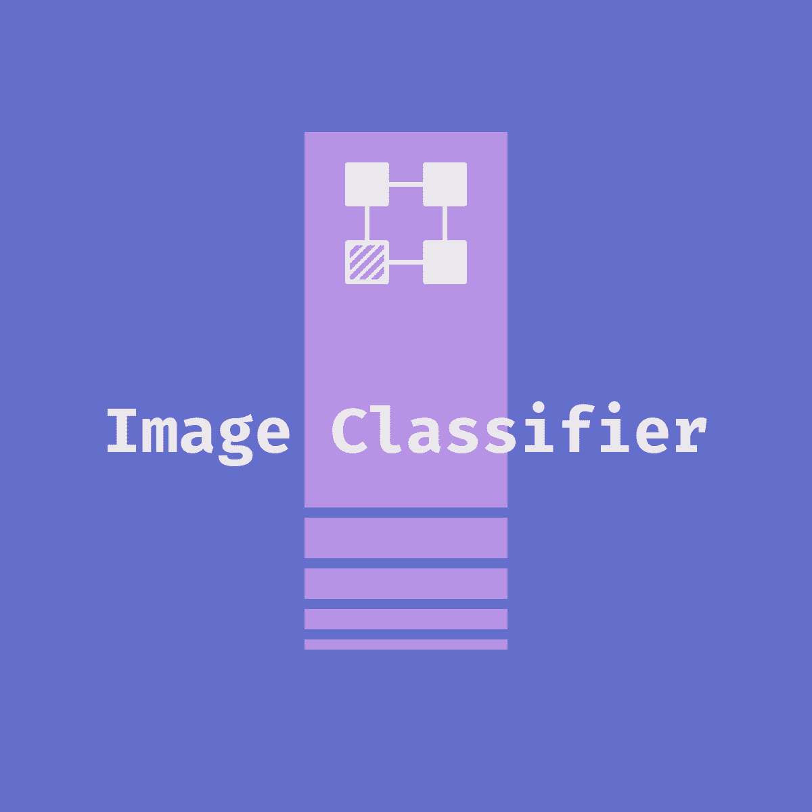

[![Contributors][contributors-shield]][contributors-url]
[![Forks][forks-shield]][forks-url]
[![Stargazers][stars-shield]][stars-url]
[![Issues][issues-shield]][issues-url]
[![MIT License][license-shield]][license-url]
[![LinkedIn][linkedin-shield]][linkedin-url]


<!-- PROJECT LOGO -->
<br />
<p align="center">
  <a href="https://github.com/dariustorabian/image-classifier">
    
  </a>

  <h3 align="center">Image Classifier</h3>

  <p align="center">
    Utilizing a Convolutional-Neural-Network to perform image classification on fruits.
    <br />
    <br />
    <a href="https://github.com/dariustorabian/image-classifier/issues">Report Bug</a>
    ·
    <a href="https://github.com/dariustorabian/image-classifier/issues">Request Feature</a>
  </p>
</p>


<!-- TABLE OF CONTENTS -->
## Table of Contents

* [About the Project](#about-the-project)
  * [Built With](#built-with)
* [Getting Started](#getting-started)
  * [Prerequisites](#prerequisites)
  * [Installation](#installation)
* [Roadmap](#roadmap)
* [Contributing](#contributing)
* [License](#license)
* [Contact](#contact)
* [Acknowledgements](#acknowledgements)


<!-- ABOUT THE PROJECT -->
## About The Project


In this project, I've built a neural-network powered image classifier, that utilizes the users webcam to predict the type of fruit in the frame. 

Of course this project doesn't have any real-world impact by itself. But similar machine-learning methods for image classification tasks are already revolutionizing fields with a much higher real-world impact like e.g. the classification of different cancer types or to make split-second decisions in the realm of autonomous driving.

The used dataset for training and validation has been manually shot and merged by my fellow data scientists [Malte Bonart](https://github.com/bonartm), [Samuel McGuire](https://github.com/samueladamsmcguire) and myself. It consists of `140 images of oranges`, `91 images of apples` and `46 images of bananas`. I'm using a 80% training, 20% validation split. Even though it is a relative small and imbalanced dataset with only 277 images in total, the trained model performs quite well after training and achieves a validation accuracy in the high 90s.

The architecture of the neural-network I've chosen has `2,797,795` total trainable params. It is a CNN (Convolutional-Neural-Network) with multiple units comprised of `2D convolutional` layer and `MaxPooling2D` layer with a pool size of `(2, 2)`. After three of those units, the output is then flattened and put in a `Dense` layer, followed by a `Dropout` layer to aid with preventing overfitting, followed by another `Dense` layer. All hidden layers are utilizing a `ReLU` activation function, while the output-layer utilizes a `Softmax` activation function. As this is a multi-class classification task, I'm using the `categorical_crossentropy` loss function. 

The model has been trained locally on a Macbook Pro 13-inch with a 2,3 GHz Quad-Core Intel Core i5.

Take a look at the neural-network architecture here:


I've also built an easy-to-use interface to test out the model utilizing your webcam. After following the instructions below, you can hold up an apple, banana or orange and after pressing 'p', the model will predict the fruit you're holding.


### Built With

* [Tensorflow's Keras](https://www.tensorflow.org/api_docs/python/tf/keras)
* [Open CV](https://opencv.org/)


<!-- GETTING STARTED -->
## Getting Started

To get a local copy up and running follow these simple steps.

### Prerequisites

I'd advice you to create an own virtual environment for this project. I'm using [Anaconda](https://anaconda.org/).


### Installation & Usage

1. Clone the repo
```sh
git clone https://github.com/dariustorabian/image-classifier.git
```
2. Install dependencies with the requirements.txt
```sh
conda create --name <NameOfEnvironment> --file requirements.txt
```

3. Run [capture.py](https://github.com/dariustorabian/image-classifier/blob/master/src/capture.py) in the command line and your webcam will open up. My pretrained model will automatically be loaded in. If you'd like to know how it was created, you can take a look at the code in the Jupyter Notebook [model_selftrained.ipynb](https://github.com/dariustorabian/image-classifier/blob/master/notebooks/model_selftrained.ipynb).

4. Press the `p` key while holding an apple, orange or banana to let the model tell you which fruit you are holding. Press `Space` to take a picture and `q` to close the window. Pictures will be saved in `./out/` if not specified otherwise per command-line argument while runing `capture.py`.


<!-- ROADMAP -->
## Roadmap

Currently, there are no new features in planning. This could change though, so feel free to check back again.

You can also always take a look at the [open issues](https://github.com/dariustorabian/image-classifier/issues) for a list of proposed features (and known issues).


<!-- CONTRIBUTING -->
## Contributing

Contributions are what make the open source community such an amazing place to be learn, inspire, and create. Any contributions you make are **greatly appreciated**.

1. Fork the Project
2. Create your Feature Branch (`git checkout -b feature/AmazingFeature`)
3. Commit your Changes (`git commit -m 'Add some AmazingFeature'`)
4. Push to the Branch (`git push origin feature/AmazingFeature`)
5. Open a Pull Request


<!-- LICENSE -->
## License

Distributed under the MIT License. See `LICENSE` for more information.


<!-- CONTACT -->
## Contact

Darius Torabian

* Feel free to contact me via [mail](mailto:darius.torabian@gmail.com).
* Here's my [linkedin profile](https://www.linkedin.com/in/dariustorabian).
* My twitter-handle is:[@darius_torabian](https://twitter.com/darius_torabian).
* This is my [website](https://dariustorabian.de).

Project Link: [https://github.com/dariustorabian/image-classifier](https://github.com/dariustorabian/image-classifier)


<!-- ACKNOWLEDGEMENTS -->
## Acknowledgements

* [Netron](https://github.com/lutzroeder/netron) - Great tool to visualize NN-architectures

* [OpenSansEmoji](https://github.com/MorbZ/OpenSansEmoji
) - Great font that is capable of displaying Emoji symbols.


<!-- MARKDOWN LINKS & IMAGES -->
<!-- https://www.markdownguide.org/basic-syntax/#reference-style-links -->
[contributors-shield]: https://img.shields.io/github/contributors/dariustorabian/lyrics-classifier.svg?style=flat-square
[contributors-url]: https://github.com/dariustorabian/image-classifier/graphs/contributors
[forks-shield]: https://img.shields.io/github/forks/dariustorabian/lyrics-classifier.svg?style=flat-square
[forks-url]: https://github.com/dariustorabian/image-classifier/network/members
[stars-shield]: https://img.shields.io/github/stars/dariustorabian/lyrics-classifier.svg?style=flat-square
[stars-url]: https://github.com/dariustorabian/image-classifier/stargazers
[issues-shield]: https://img.shields.io/github/issues/dariustorabian/lyrics-classifier.svg?style=flat-square
[issues-url]: https://github.com/dariustorabian/image-classifier/issue
[license-shield]: https://img.shields.io/github/license/dariustorabian/lyrics-classifier.svg?style=flat-square
[license-url]: https://github.com/dariustorabian/image-classifier/LICENSE.txt
[linkedin-shield]: https://img.shields.io/badge/-LinkedIn-black.svg?style=flat-square&logo=linkedin&colorB=555
[linkedin-url]: https://www.linkedin.com/in/dariustorabian
[product-screenshot]: images/screenshot.png
